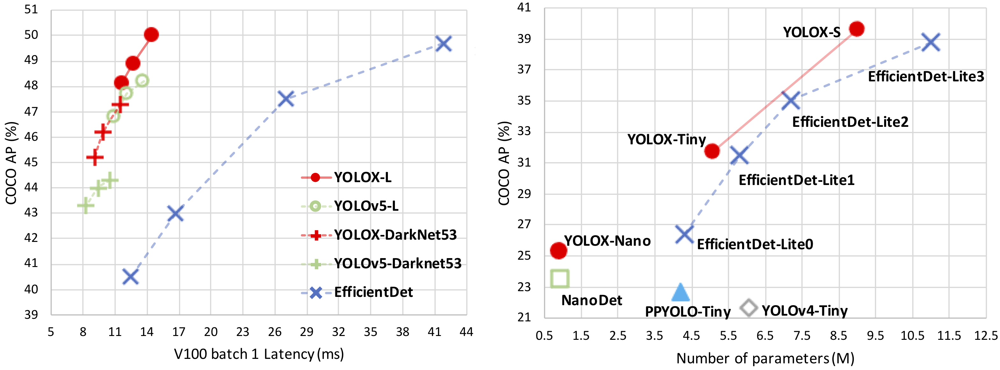

<div align="center"></div>


## Introduction
YOLOX is an anchor-free version of YOLO, with a simpler design but better performance! It aims to bridge the gap between research and industrial communities.
For more details, please refer to our [report on Arxiv](https://arxiv.org/abs/2107.08430).

This repo is an implementation of PyTorch version YOLOX, there is also a [MegEngine implementation](https://github.com/MegEngine/YOLOX).




## Quick Start

<details>
<summary>Installation</summary>

Step1. Install YOLOX.
```shell
git clone https://github.com/SOPHIC-AI/YOLOX-Sophic
cd YOLOX
pip3 install -r requirements.txt
```

Step2. Install [pycocotools](https://github.com/cocodataset/cocoapi).

```shell
pip3 install cython; pip3 install 'git+https://github.com/cocodataset/cocoapi.git#subdirectory=PythonAPI'
```

</details>

<details>
<summary>Training</summary>

```shell
python3 tools/train.py -f exps/example/yolox_voc/yolox_voc_nano.py -d 0 -b 64 --fp16 -o 
```
* -d: number of gpu devices
* -b: total batch size, the recommended number for -b is num-gpu * 8
* --fp16: mixed precision training

</details>

<details>
<summary>Demo</summary>

Step1. Download a pretrained model from the benchmark table.

Step2. Use either -n or -f to specify your detector's config. For example:

```shell
python tools/demo.py image -f exps/example/yolox_voc/yolox_voc_nano.py -c {path of checkpoint} --path {path of image} --conf 0.5 --nms 0.2 --tsize 640 --save_result --device [cpu/gpu]
```
Demo for video:
```shell
python tools/demo.py video -f exps/example/yolox_voc/yolox_voc_nano.py -c {path of checkpoint} --path {path of video} --conf 0.5 --nms 0.2 --tsize 640 --save_result --device [cpu/gpu]
```
Demo for webcam:
```shell
python tools/demo.py webcam -f exps/example/yolox_voc/yolox_voc_nano.py -c {path of checkpoint} --camid {id of webcam} --conf 0.5 --nms 0.2 --tsize 640 --save_result --device [cpu/gpu]
```


</details>

<details>
<summary>Tutorials</summary>

*  [Training on custom data](docs/train_custom_data.md)
*  [Manipulating training image size](docs/manipulate_training_image_size.md)

</details>

## Deployment


1.  [MegEngine in C++ and Python](./demo/MegEngine)
2.  [ONNX export and an ONNXRuntime](./demo/ONNXRuntime)
3.  [TensorRT in C++ and Python](./demo/TensorRT)
4.  [ncnn in C++ and Java](./demo/ncnn)
5.  [OpenVINO in C++ and Python](./demo/OpenVINO)
